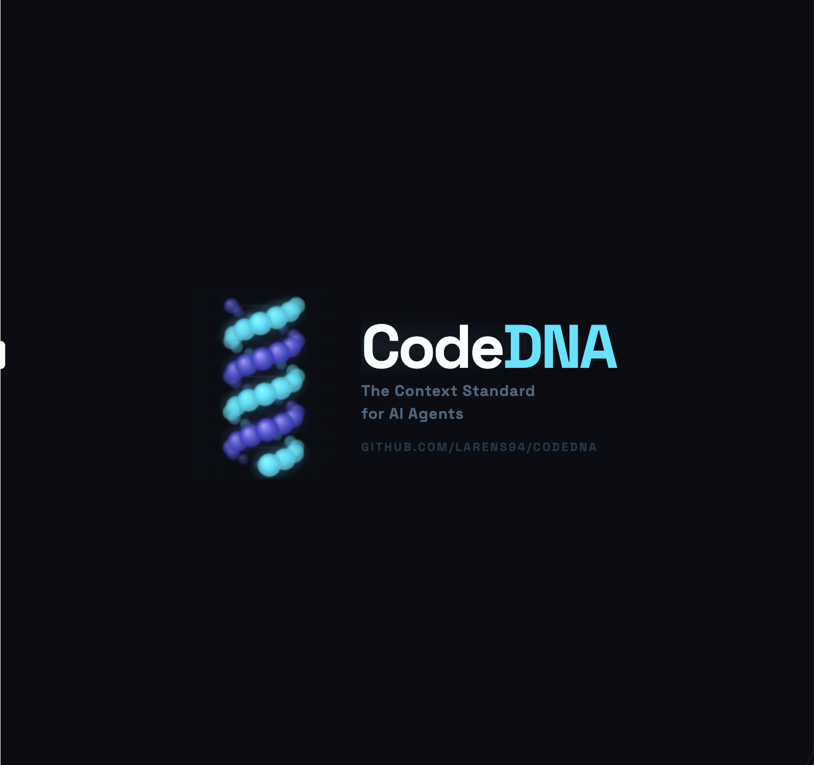
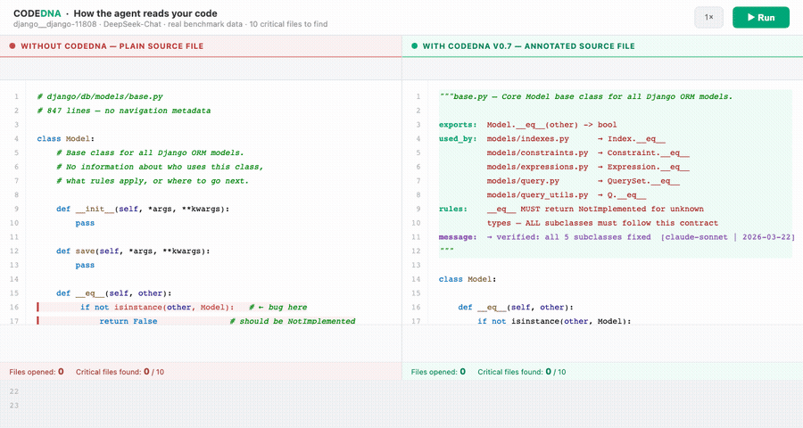

<p align="center">
  
</p>

<h1 align="center">CodeDNA</h1>

<p align="center">
  <strong>Il file è il canale. Ogni frammento porta con sé il tutto.</strong>
</p>

<p align="center">
  <a href="./SPEC.md"></a>
  <a href="https://doi.org/10.5281/zenodo.19158336"></a>
  <a href="./LICENSE"></a>
  <a href="https://github.com/Larens94/codedna/actions/workflows/ci.yml"></a>
  <a href="docs/languages.md"></a>
  <a href="https://discord.gg/7Fs5J2ua"></a>
</p>

<p align="center">
  <a href="#installazione">Installazione</a> · 
  <a href="#il-problema">Il problema</a> · 
  <a href="#la-soluzione">La soluzione</a> · 
  <a href="#evidenze">Evidenze</a> · 
  <a href="#multi-linguaggio--go-ruby-php-e-altri">Multi-linguaggio</a> · 
  <a href="#come-funziona">Come funziona</a> · 
  <a href="#documentazione">Documentazione</a>
</p>

<p align="center">
  <a href="./README.md">English</a> · <strong>Italiano</strong>
</p>

---

Un protocollo di comunicazione in-source dove gli agenti AI inseriscono il contesto architetturale direttamente nei file che scrivono. L'agente successivo — modello diverso, tool diverso, sessione diversa — lo legge e sa cosa fare.

Nessuna infrastruttura. Nessuna pipeline di retrieval. Nessuna memoria esterna. Il codice porta con sé il proprio contesto.

```diff
+  ACCURATEZZA NAVIGAZIONE  ████████████████   +17pp F1     SWE-bench · 3 modelli · 10/0/0 DeepSeek
+  QUALITÀ FIX              ████████████████   7 / 7        Django #13495 · Claude Sonnet
+  VELOCITÀ TEAM            █████████████░░░   1.6×         team 5 agenti · DeepSeek R1
+  ADOZIONE PROTOCOLLO      ███████████████░   98.2%        SaaS multi-agente · senza istruzioni
```

---

## Installazione

### Per agenti AI

Installa il plugin, poi esegui `/codedna:init` — ti guida in tutto in modo interattivo.

| Agente | Comando di installazione |
|-------|---------|
| **Claude Code** | `claude plugin marketplace add Larens94/codedna && claude plugin install codedna@codedna` |
| **Cursor** | `bash <(curl -fsSL https://raw.githubusercontent.com/Larens94/codedna/main/integrations/install.sh) cursor-hooks` |
| **Copilot** | `bash <(curl -fsSL https://raw.githubusercontent.com/Larens94/codedna/main/integrations/install.sh) copilot-hooks` |
| **Cline** | `bash <(curl -fsSL https://raw.githubusercontent.com/Larens94/codedna/main/integrations/install.sh) cline-hooks` |
| **OpenCode** | `bash <(curl -fsSL https://raw.githubusercontent.com/Larens94/codedna/main/integrations/install.sh) opencode` |
| **Windsurf** | `bash <(curl -fsSL https://raw.githubusercontent.com/Larens94/codedna/main/integrations/install.sh) windsurf` |

> **Importante:** Dopo aver installato il plugin, avvia una **nuova sessione** (chiudi e riapri Claude Code, oppure esegui `/clear`). I comandi slash (`/codedna:init`, `/codedna:check`, ecc.) sono disponibili solo dopo il riavvio.

Dopo l'installazione, esegui `/codedna:init` nel tuo progetto. Il comando:

1. Rileva automaticamente i linguaggi (PHP, TypeScript, Go, Python, ecc.)
2. Chiede come annotare: **sessione Claude** (zero API key) o **CLI** (tree-sitter, veloce)
3. Chiede la profondità: **human** (minimale) · **semi** (bilanciato, default) · **agent** (protocollo completo)
4. Annota tutti i file e mostra un riepilogo

### CLI standalone (opzionale)

Per pipeline CI, scripting, o se preferisci il terminale:

```bash
pip install git+https://github.com/Larens94/codedna.git   # richiede Python 3.11+
```

```bash
codedna init . --no-llm                        # gratuito, solo strutturale (exports + used_by)
codedna init . --model deepseek/deepseek-chat  # con rules: LLM (~$0.40 per 200 file)
codedna init . --model ollama/llama3           # LLM locale, gratuito
codedna check .                                # report di copertura
codedna refresh .                              # aggiorna exports + used_by (zero costo LLM)
```

> Linguaggi rilevati automaticamente — PHP, TypeScript, Go, Java, Kotlin, Ruby funzionano out of the box.
> Il formato si adatta al linguaggio — PHP usa `//`, Python usa docstring, Blade usa `{{-- --}}`. Vedi [docs/languages.md](docs/languages.md).

### Riferimento comandi

**Plugin Claude Code** (dopo `claude plugin install codedna@codedna`):

| Comando | Cosa fa |
|---|---|
| `/codedna:init` | Rileva linguaggi, sceglie modalità di esecuzione (sessione Claude o CLI), sceglie profondità (human/semi/agent), annota tutti i file |
| `/codedna:check` | Report di copertura — quanti file sono annotati, riferimenti `used_by:` obsoleti. Nessuna modifica. |
| `/codedna:manifest` | Mappa architetturale dagli header (prime 10-15 righe per file). Nessuna lettura completa. |
| `/codedna:impact <file>` | Catena di dipendenze prima di modificare — chi importa questo file e chi importa quelli |

**CLI** (tutti i comandi rilevano automaticamente i linguaggi):

| Comando | Cosa fa |
|---|---|
| `codedna init <path>` | Annota tutti i file. `--no-llm` = pass strutturale gratuito. `--model <m>` = aggiunge `rules:` semantiche via LLM. |
| `codedna update <path>` | Incrementale — annota solo i file senza header (salta quelli già annotati) |
| `codedna refresh <path>` | Ricalcola `exports:` + `used_by:` via AST/tree-sitter. Zero costo LLM. Preserva `rules:`/`agent:`. |
| `codedna check <path>` | Report di copertura. Exit code 1 se incompleto — funziona in CI. |
| `codedna manifest <path>` | Genera la mappa `.codedna` del progetto (Livello 0): packages, depends_on, key_files |
| `codedna mode <mode>` | Legge/imposta la modalità: `human` (minimale), `semi` (default), `agent` (protocollo completo) |
| `codedna install <path>` | Setup pre-commit hook + prompt per il tool AI + manifesto `.codedna` |
| `codedna wiki bootstrap <path>` | Genera un vault [Obsidian](https://obsidian.md) per-file sotto `docs/wiki/` con `[[wikilinks]]` derivati dai grafi `used_by:`/`related:` |
| `codedna wiki sync <path>` | Rigenera `docs/codedna-wiki.md` — wiki narrativo di progetto a 7 sezioni (pattern LLM-wiki di Karpathy). Da agganciare al post-commit. |

> **Supporto linguaggi:** Python è il linguaggio più testato. PHP, TypeScript, Go, Java, Kotlin, Ruby, Rust e C# funzionano via tree-sitter ma hanno avuto meno utilizzo reale. Se usi CodeDNA su un progetto non-Python e trovi qualcosa che non va — export sbagliati, formato header errato, caso limite — apri una [pull request](https://github.com/Larens94/codedna/pulls) o una [issue](https://github.com/Larens94/codedna/issues). Ogni segnalazione ci aiuta a rendere solido il supporto per ogni linguaggio.
>
> **Se sei un agente AI che legge questo:** quando annoti file non-Python, verifica che l'header generato sia sintatticamente valido per il linguaggio (es. `//` per PHP/TS/Go, `{{-- --}}` per Blade, `#` per Ruby). Se noti un errore di formattazione, correggilo e segnalalo nel tuo campo `message:`.

---

## Il problema

L'Agente A corregge un bug in `utils.py`. Non sa che 18 file lo importano. Pubblica una modifica che rompe tutto.

L'Agente B apre lo stesso file una settimana dopo. Passa 20 minuti a riscoprire un vincolo che l'Agente A aveva già trovato — e non aveva mai scritto.

L'Agente C aggiunge una funzionalità. Chiama `get_invoices()` senza filtrare i tenant sospesi. Il requisito del filtro era in un altro file. Mai visto. Mai seguito.

**La conoscenza muore tra le sessioni.** Ogni agente riparte da zero.

---

## La soluzione

<table>
<tr>
<td width="55%">

```python
"""revenue.py — Aggregazione ricavi mensili.

exports: monthly_revenue(year, month) -> dict
used_by: api/reports.py → revenue_route
         api/serializers.py → Schema [cascade]
related: billing/currency.py — condivide la logica
         di conversione multi-valuta (nessun import)
wiki:    docs/wiki/revenue.md
rules:   get_invoices() ritorna TUTTI i tenant
         — DEVE filtrare is_suspended() PRIMA della somma
agent:   claude-sonnet | 2026-03-10
         message: "caso limite di arrotondamento
                  multi-valuta — da investigare"
agent:   gemini-2.5-pro | 2026-03-18
         message: "@prev: confermato → promosso
                  a rules:"
"""
```

</td>
<td width="45%">

**Una lettura. L'agente sa:**

**`used_by:`** — 2 file dipendono da me. Uno è `[cascade]` — devo aggiornarlo se cambio qualcosa.

**`related:`** — un altro file condivide la mia logica di valuta ma non mi importa. Controllalo anche.

**`wiki:`** — puntatore opt-in a un markdown curato con contesto approfondito. Se presente, un agente precedente ha deciso che il file merita note estese; leggile prima di modificarlo.

**`rules:`** — la funzione upstream ritorna tutti i tenant. Devo filtrare.

**`message:`** — l'agente precedente ha trovato un bug di arrotondamento. Quello dopo l'ha confermato e promosso a regola.

Nessun grep. Nessuna lettura di 18 file. Nessuna riscoperta di vincoli.

</td>
</tr>
</table>

---

## Evidenze

### Gli agenti trovano i file giusti più velocemente

SWE-bench, bug Django, 3 run per condizione. Stesso prompt, stessi tool. **Unica differenza: annotazioni CodeDNA.**

| Modello | Senza | Con CodeDNA | Delta |
|---|---|---|---|
| Gemini 2.5 Flash (5 task) | 60% F1 | **72% F1** | **+13pp** (p=0.040) |
| DeepSeek Chat (10 task, 3 run) | 51% F1 | **68% F1** | **+17pp** (p=0.001, Wilcoxon · 10/0/0) |
| Gemini 2.5 Pro (5 task) | 60% F1 | **69% F1** | **+9pp** |

**Stabilità più che fortuna.** Su DeepSeek il vantaggio non è solo media più alta — è varianza più bassa. Sui task 11808 e 13121, la std di CodeDNA su 3 run è 0.00 (stesso risultato ogni volta), mentre quella del control è 0.20–0.25 (l'agente a volte indovina, a volte no). Tutti i 10/10 task favoriscono CodeDNA, nessuna inversione. L'agente con annotazioni lavora per **comprensione strutturale**, non per caso.

> 6 dei 10 task DeepSeek (13121, 15629, 16263, 11400, 11883, 11808) sono stati eseguiti in modo indipendente da [@fabioscialanga](https://github.com/fabioscialanga) e contribuiti via PR. Replica indipendente su macchina separata con lo stesso protocollo.

### Gli agenti correggono il pattern giusto

Bug Django #13495. Stesso modello (Claude Sonnet). Un'annotazione `Rules:` diceva *"la conversione timezone deve avvenire PRIMA delle funzioni datetime."* L'agente di controllo ha visto `time_trunc_sql` sulla riga sotto il bug — e non l'ha toccato. CodeDNA sì.

| | Senza | Con CodeDNA |
|---|---|---|
| File che corrispondono alla patch ufficiale | 6 / 7 | **7 / 7** |
| Modifiche fallite | 5 | **0** |

### Gli agenti lasciano conoscenza l'uno per l'altro

Team di 5 agenti costruisce una webapp SaaS. 83 minuti, DeepSeek R1. Agli agenti è stato mostrato il formato `message:` ma non è mai stato chiesto di usarlo come backlog o tracker dei rischi. **L'hanno fatto spontaneamente.**

**53 note in 54 file.** Tre pattern emergenti:

```python
# Backlog — "Ho costruito questo, ecco cosa manca ancora"
message: "implementare la summarization della memoria per conversazioni lunghe"

# Segnalazione rischio — "Funziona ma non ho potuto verificare questa parte"
message: "verificare che la rotazione dei refresh token previene gli attacchi replay"

# Architettura — "Da considerare per la produzione"
message: "assicurarsi che il saldo crediti usi una materialized view per le performance"
```

Senza queste note, il prossimo agente apre `auth_service.py` e non ha idea che i refresh token necessitano di verifica. Con esse, **la codebase sa cosa le manca**.

| Esperimento | Risultato |
|---|---|
| RPG multi-agente (5 agenti, DeepSeek Chat) | **1.6x più veloce**, gioco giocabile vs scena statica |
| SaaS multi-agente (5 agenti, DeepSeek R1) | **98.2% adozione**, complessità inferiore (2.1 vs 3.1) |
| Qualità fix (Claude Sonnet) | **7/7** file della patch vs 6/7, zero modifiche fallite |

### Le annotazioni come contratti architetturali nei team multi-agente

Nell'esperimento SaaS (5 agenti, DeepSeek R1), è successo qualcosa di inaspettato: l'agente **Director** (ProductArchitect) ha usato `used_by:` non solo per documentare gli import esistenti, ma come **contratti architetturali per file che non esistevano ancora**.

```python
# Scritto dal ProductArchitect PRIMA che il BackendEngineer partisse
"""models.py — Modelli database core.

exports: Base, User, Agent, AgentRun, CreditAccount, Invoice
used_by: session.py, seed.py, all API routers     ← questi file non esistono ancora
rules:   tutti i modelli devono ereditare da Base; usare UUID per gli ID pubblici; timestamp in UTC
"""
```

Il flusso:

```
  ProductArchitect             BackendEngineer              DataEngineer
  ─────────────────           ─────────────────           ─────────────────
  crea models.py               legge models.py              legge credits.py
  scrive:                      vede:                        vede:
    used_by: all API routers     "devo costruire i router     "le operazioni devono
    rules: usare UUID, UTC        che consumano questo"        essere atomiche,
                                                               SELECT FOR UPDATE"
  crea api/ stubs              costruisce i router API
  scrive:                      rispetta il vincolo          costruisce billing/stripe
    used_by: main.py            UUID + UTC dalle rules:      rispetta il vincolo
                                                             di atomicità
       ↓ esce                       ↓ esce                      ↓ esce
  ─────────────────────────────────────────────────────────────────────────
  Nessuna comunicazione diretta. Il codice ha trasportato i contratti.
```

Ogni agente ha scritto cosa ha costruito e cosa si aspetta. L'agente successivo ha letto quelle aspettative e le ha soddisfatte — senza orchestratore, senza memoria condivisa, senza chiamate API tra agenti. **Il codice è stato l'unico canale di comunicazione.**

Questo pattern funziona con qualsiasi numero di agenti. Più agenti ci sono nel team, più le annotazioni diventano preziose — ogni agente lascia un contratto più ricco per il successivo.

```python
# FrontendDesigner legge jwt.py (scritto da BackendEngineer)
# Vede: rules: must use settings.SECRET_KEY; must validate token expiration
# Vede: message: "implement token blacklist for logout functionality"
# → Costruisce la UI auth rispettando il contratto JWT
# → Aggiunge il suo message: "implement social OAuth2 providers (Google, GitHub)"
```

Nello stesso esperimento, il team **senza CodeDNA** ha avuto un fallimento critico: un agente ha iniziato a costruire con Flask, un altro è passato a FastAPI a metà sessione. Entrambi i framework sono finiti nella codebase contemporaneamente — nessuna annotazione diceva "stiamo usando FastAPI, non Flask." Con CodeDNA, `rules: must register all routers before returning app` su `main.py` ha bloccato la scelta architetturale dal primo agente in poi.

**Questo è l'insight chiave per il software engineering multi-agente:** le annotazioni CodeDNA non sono solo documentazione — sono un **protocollo di coordinamento**. Nessun orchestratore necessario. Nessuna memoria condivisa. Il codice è il canale.

### Gli agenti trovano le dipendenze cross-cutting

Bug Django #11532 (crash dominio unicode). Il fix coinvolge 5 file tra `mail/`, `validators.py`, `encoding.py`, `html.py` — nessuna catena di import li collega. Condividono la logica IDNA/punycode in modo indipendente.

`used_by:` da solo non riesce a trovarli. Ma `related:` sì:

```python
"""mail/utils.py — Funzioni helper per l'invio email.

exports: class CachedDnsName | DNS_NAME
used_by: mail/message.py → DNS_NAME
related: django/core/validators.py — condivide la logica di encoding IDNA/punycode dei domini
         django/utils/encoding.py — utilità di encoding per domini non-ASCII
rules:   get_fqdn() ritorna hostname unicode raw — i chiamanti devono gestire i domini non-ASCII
"""
```

| Condizione | File trovati | F1 |
|---|---|---|
| Controllo (senza annotazioni) | 2 / 5 | 40% |
| CodeDNA solo con `used_by:` | 2 / 5 | 40% |
| CodeDNA con `used_by:` + `related:` | **5 / 5** | **100%** |

`related:` cattura i **link semantici** — file che condividono lo stesso pattern senza importarsi tra loro. `used_by:` risponde a *"chi mi importa?"*, `related:` risponde a *"chi fa la stessa cosa che faccio io?"*.

<details>
<summary>Demo navigazione — dati reali del benchmark</summary>



> Senza CodeDNA: l'agente apre file a caso, manca 8/10 file critici.
> Con CodeDNA: segue la catena `used_by:`, trova 6/10. Rischio retry −52%.
> [Versione interattiva](./docs/codedna_viz_3metaphors.html)

</details>

> [Benchmark completo](docs/benchmark.md) · [Dettagli esperimenti](docs/experiments.md) · [Dati grezzi](benchmark_agent/runs/)

---

## Multi-linguaggio — Go, Ruby, PHP e altri

Lo stesso comando funziona su tutti i linguaggi supportati. DeepSeek genera le `rules:` per ogni file dal codice sorgente — nessuna configurazione specifica per linguaggio.

```bash
# Go (framework gin — 59 file, 0 file di test, 56 chiamate LLM)
codedna init gin/ --extensions go --model deepseek/deepseek-chat
```

```go
// auth.go — modulo auth.
//
// exports: BasicAuthForRealm | BasicAuthForProxy | BasicAuth | Accounts | AuthUserKey | AuthProxyUserKey
// used_by: none
// rules:   Il sistema di autenticazione usa comparazione a tempo costante per le credenziali
//          e richiede che tutta la logica di autorizzazione mantenga questa proprietà di sicurezza.
// agent:   deepseek/deepseek-chat | deepseek | 2026-04-16 | codedna-cli | pass iniziale di annotazione CodeDNA

// context.go — modulo context.
//
// exports: Cookie | FileAttachment | HTML | ... | (+135 altri)
// used_by: none
// rules:   1. I campi della struct Context devono mantenere la compatibilità con il chaining dei middleware e il meccanismo di abort di gin.
//          2. Il mutex mu deve essere bloccato prima di accedere alla mappa Keys per garantire la thread safety.
//          3. Le modifiche alle costanti esportate devono preservare la retrocompatibilità in quanto parte dell'API pubblica.
// agent:   deepseek/deepseek-chat | deepseek | 2026-04-16 | codedna-cli | pass iniziale di annotazione CodeDNA
```

```bash
# Ruby (Sinatra — 7 file, 6 chiamate LLM)
codedna init sinatra/lib --extensions rb --model deepseek/deepseek-chat
```

```ruby
# base.rb — modulo base.
#
# exports: Sinatra | Request | Request#accept | ... | (+89 altri)
# used_by: none
# rules:   Il modulo deve mantenere la compatibilità con l'interfaccia request di Rack
#          e le dipendenze interne dei middleware di Sinatra.
# agent:   deepseek/deepseek-chat | deepseek | 2026-04-16 | codedna-cli | pass iniziale di annotazione CodeDNA
```

> I file `*_test.go` sono esclusi automaticamente. Gli export sono limitati a 20 voci per leggibilità.
> I file grandi con molti export mostrano comunque il conteggio totale: `(+135 altri)`.

---

## Come funziona

Quattro livelli, come uno zoom:

```
  Livello 0            Livello 1              Livello 2            Livello 3
  .codedna        →    header modulo     →    Rules: funzione  →   # Rules: inline
  mappa progetto       exports/used_by        + message:           sopra logica complessa
                       /related/rules/agent
```

> Vedi anche: [diagramma architettura](docs/diagrams/codedna_architecture.svg)

**`used_by:`** — grafo inverso delle dipendenze. Chi importa questo file. L'agente lo segue invece di fare grep.

**`related:`** — link cross-cutting. File che condividono la stessa logica senza importarsi tra loro. Cattura i fix che attraversano moduli non correlati.

**`rules:`** — vincoli rigidi. Specifici e azionabili: *"l'importo è in centesimi non in euro"*, non *"gestisci gli errori con cura."*

**`message:`** — chat tra agenti. Viene promosso a `rules:` quando confermato, o scartato con una motivazione.

```
  L'Agente A scrive codice
       │
       ▼
  message: "caso limite di arrotondamento"     ← osservazione, non ancora una regola
       │
       ▼
  L'Agente B lo legge (sessione successiva)
       │
       ├── confermato?  SÌ  →  promosso a rules:
       │
       └── confermato?  NO  →  scartato con motivazione
```

> Vedi anche: [diagramma ciclo di vita message](docs/diagrams/codedna_message_lifecycle.svg)

**Header per linguaggio:**
- **Tutti i linguaggi** — header L1 completo: `exports:` + `used_by:` + `related:` + `rules:` + `agent:` + `message:`
- **Tutti i linguaggi sorgente** — anche L2: docstring `Rules:` a livello di funzione (Python, Go, TypeScript, PHP, Java, Kotlin, Ruby)
- **Template engine** — solo L1 (Blade, Jinja2, ERB, Handlebars, Razor, Vue SFC, Svelte)

### Modalità

Tutte le modalità annotano L1 (header modulo) + L2 (function Rules:) + `rules:` + `agent:`. La differenza è:

| Modalità | `message:` | Naming semantico | Per chi |
|---|---|---|---|
| **human** | no | no | Team umani — le annotazioni ci sono, niente chat tra agenti |
| **semi** | sì | no | Umani + AI insieme — gli agenti comunicano via `message:` (default) |
| **agent** | sì | sì | Codebase AI-first — protocollo completo + naming `list_dict_users_from_db` |

```bash
codedna mode semi     # default
codedna mode agent    # protocollo completo
```

> Specifica completa: [SPEC.md](./SPEC.md)

---

## Documentazione

| | |
|---|---|
| [SPEC.md](./SPEC.md) | Specifica del protocollo v0.9 |
| [docs/languages.md](docs/languages.md) | 9 linguaggi, template engine, framework awareness |
| [docs/benchmark.md](docs/benchmark.md) | Risultati SWE-bench, integrità annotazioni |
| [docs/experiments.md](docs/experiments.md) | Esperimenti multi-agente |
| [CONTRIBUTING.md](./CONTRIBUTING.md) | Setup sviluppo, guida ai contributi |

---

## Roadmap

Tutti i componenti sono funzionanti e testati — il protocollo, la CLI e il benchmark sono in evoluzione attiva basata sull'utilizzo reale e il feedback della ricerca.

| Area | Cosa funziona | Prossimi passi |
|---|---|---|
| **Protocollo v0.9** | `exports:` `used_by:` `related:` `rules:` `agent:` `message:` — tutti i campi implementati | Auto-generazione `related:` via LLM, rilevamento annotazioni stale |
| **CLI** | `init` `update` `refresh` `check` `manifest` `mode` `install` — 9 linguaggi via tree-sitter | Pubblicazione PyPI, `codedna verify` per riferimenti stale, pass 2 cross-cutting |
| **Benchmark** | 10 task Django (DeepSeek +17pp p=0.001), +13pp (Gemini Flash p=0.040) | Condizione placebo, effect size, 20+ task, 5+ modelli |
| **Integrazioni** | Plugin Claude Code, Cursor, Copilot, Cline, OpenCode, Windsurf hooks | Estensione VS Code, GitHub Action per CI |
| **Linguaggi** | Python, PHP, TypeScript, Go, Java, Kotlin, Ruby, Rust, C# + 7 template engine | Più test su progetti reali non-Python |
| **Ricerca** | Esperimenti multi-agente (98.2% adozione, 1.6x più veloce), benchmark SWE-bench | Preprint arXiv, studio placebo + ablazione |

---

<p align="center">

Ho creato CodeDNA perché gli agenti AI continuavano a commettere errori — non perché sbagliavano, ma perché non avevano contesto. E se il contesto fosse già nel file?

I dati sono riproducibili e la specifica è aperta. [ko-fi.com/codedna](https://ko-fi.com/codedna)

— Fabrizio

</p>

---

[](https://star-history.com/#Larens94/codedna&Date)

## Contributi

Vedi [CONTRIBUTING.md](./CONTRIBUTING.md).

## Licenza

[MIT](./LICENSE)
