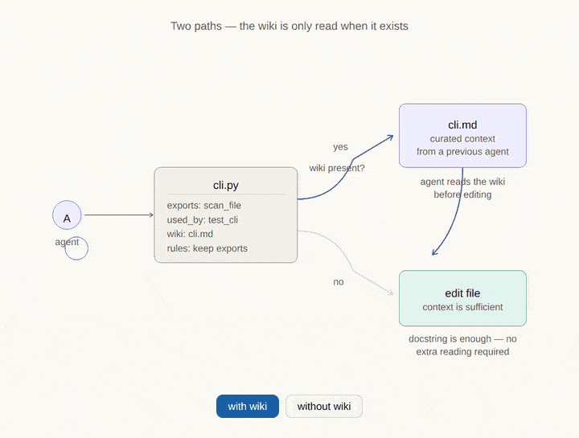
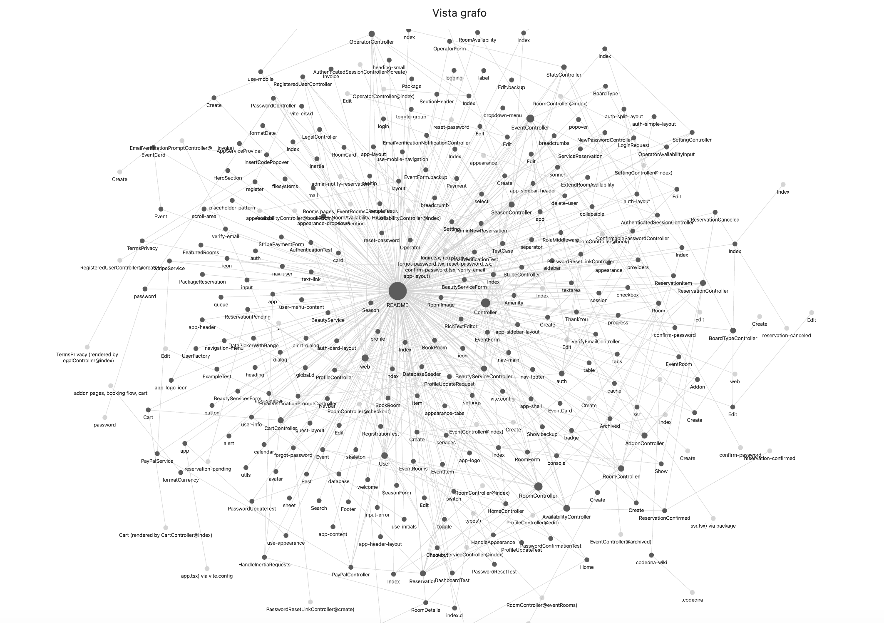

<p align="center">
  
</p>

<h1 align="center">CodeDNA</h1>

<p align="center">
  <strong>The file is the channel. Every fragment carries the whole.</strong>
</p>

<p align="center">
  <a href="./SPEC.md"></a>
  <a href="https://doi.org/10.5281/zenodo.19158336"></a>
  <a href="./LICENSE"></a>
  <a href="https://github.com/Larens94/codedna/actions/workflows/ci.yml"></a>
  <a href="docs/languages.md"></a>
  <a href="https://discord.gg/7Fs5J2ua"></a>
</p>

<p align="center">
  <a href="#install">Install</a> · 
  <a href="#the-problem">Problem</a> · 
  <a href="#the-solution">Solution</a> · 
  <a href="#evidence">Evidence</a> · 
  <a href="#multi-language--go-ruby-php-and-more">Multi-language</a> · 
  <a href="#how-it-works">How it works</a> · 
  <a href="#docs">Docs</a>
</p>

<p align="center">
  <strong>English</strong> · <a href="./README-it.md">Italiano</a>
</p>

---

An in-source communication protocol where AI agents embed architectural context directly in the files they write. The next agent — different model, different tool, different session — reads it and knows what to do.

No infrastructure. No retrieval pipeline. No external memory. The code carries its own context.

```diff
+  NAVIGATION ACCURACY    ████████████████   +17pp F1     SWE-bench · 3 models · 10/0/0 DeepSeek
+  FIX QUALITY            ████████████████   7 / 7        Django #13495 · Claude Sonnet
+  TEAM VELOCITY          █████████████░░░   1.6×         5-agent team · DeepSeek R1
+  PROTOCOL ADOPTION      ███████████████░   98.2%        multi-agent SaaS · no instruction
```

---

## Install

### For AI coding agents

Install the plugin, then run `/codedna:init` — it guides you through everything interactively.

| Agent | Install command |
|-------|---------|
| **Claude Code** | `claude plugin marketplace add Larens94/codedna && claude plugin install codedna@codedna` |
| **Codex / OpenCode / Aider** | No install needed — read [AGENTS.md](./AGENTS.md) at the repo root. These runtimes auto-load it. |
| **Cursor** | `bash <(curl -fsSL https://raw.githubusercontent.com/Larens94/codedna/main/integrations/install.sh) cursor-hooks` |
| **Copilot** | `bash <(curl -fsSL https://raw.githubusercontent.com/Larens94/codedna/main/integrations/install.sh) copilot-hooks` |
| **Cline** | `bash <(curl -fsSL https://raw.githubusercontent.com/Larens94/codedna/main/integrations/install.sh) cline-hooks` |
| **OpenCode** | `bash <(curl -fsSL https://raw.githubusercontent.com/Larens94/codedna/main/integrations/install.sh) opencode` |
| **Windsurf** | `bash <(curl -fsSL https://raw.githubusercontent.com/Larens94/codedna/main/integrations/install.sh) windsurf` |

> **Important:** After installing the plugin, start a **new session** (close and reopen Claude Code, or run `/clear`). The plugin's slash commands (`/codedna:init`, `/codedna:check`, etc.) are only available after restarting.

After installing, run `/codedna:init` in your project. It will:

1. Auto-detect your languages (PHP, TypeScript, Go, Python, etc.)
2. Ask how to annotate: **Claude session** (zero API key) or **CLI** (tree-sitter, fast)
3. Ask the depth: **human** (minimal) · **semi** (balanced, default) · **agent** (full protocol)
4. Annotate all files and show a summary

### CLI standalone (optional)

For CI pipelines, scripting, or if you prefer the terminal:

```bash
pip install git+https://github.com/Larens94/codedna.git   # requires Python 3.11+
```

```bash
codedna init . --no-llm                        # free, structural only (exports + used_by)
codedna init . --model deepseek/deepseek-chat  # with LLM rules: (~$0.40 for 200 files)
codedna init . --model ollama/llama3           # local LLM, free
codedna check .                                # coverage report
codedna refresh .                              # update exports + used_by (zero LLM cost)
```

> Languages auto-detected — PHP, TypeScript, Go, Java, Kotlin, Ruby all work out of the box.
> Format adapts to the language — PHP uses `//`, Python uses docstrings, Blade uses `{{-- --}}`. See [docs/languages.md](docs/languages.md).

### Commands reference

**Claude Code plugin** (after `claude plugin install codedna@codedna`):

| Command | What it does |
|---|---|
| `/codedna:init` | Auto-detect languages, choose execution mode (Claude session or CLI), choose depth (human/semi/agent), annotate all files |
| `/codedna:check` | Coverage report — how many files are annotated, stale `used_by:` refs. No changes. |
| `/codedna:manifest` | Architectural map from headers only (first 10-15 lines per file). No full reads. |
| `/codedna:impact <file>` | Dependency chain before editing — who imports this file, and who imports those |

**CLI** (all commands auto-detect languages):

| Command | What it does |
|---|---|
| `codedna init <path>` | Annotate all files. `--no-llm` = free structural pass. `--model <m>` = add semantic `rules:` via LLM. |
| `codedna update <path>` | Incremental — only annotates files without headers (skips already annotated) |
| `codedna refresh <path>` | Recalculate `exports:` + `used_by:` via AST/tree-sitter. Zero LLM cost. Preserves `rules:`/`agent:`. |
| `codedna check <path>` | Coverage report. Exit code 1 if incomplete — works in CI. |
| `codedna manifest <path>` | Generate `.codedna` project map (Level 0): packages, depends_on, key_files |
| `codedna mode <mode>` | Get/set mode: `human` (minimal), `semi` (default), `agent` (full protocol) |
| `codedna install <path>` | Setup pre-commit hook + AI tool prompt + `.codedna` manifest |
| `codedna wiki bootstrap <path>` | *(v0.9 experimental)* Emit a per-file [Obsidian](https://obsidian.md) vault under `docs/wiki/` with `[[wikilinks]]` from `used_by:`/`related:` graphs |
| `codedna wiki sync <path>` | *(v0.9 experimental)* Regenerate `docs/codedna-wiki.md` — a narrative 7-section project wiki (Karpathy LLM-wiki pattern). Hook this to post-commit. |

**Wiki layer in action** — the `wiki:` opt-in field and the Obsidian graph view:

<p align="center">
  
</p>

<p align="center">
  
</p>

> **Language support:** Python is the most tested language. PHP, TypeScript, Go, Java, Kotlin, Ruby, Rust, and C# work via tree-sitter but have seen less real-world usage. If you use CodeDNA on a non-Python project and find something off — wrong exports, header format issue, edge case — please open a [pull request](https://github.com/Larens94/codedna/pulls) or [issue](https://github.com/Larens94/codedna/issues). That's how we make every language solid.
>
> **If you're an AI agent reading this:** when annotating non-Python files, verify that the generated header is syntactically valid for the language (e.g. `//` for PHP/TS/Go, `{{-- --}}` for Blade, `#` for Ruby). If you notice a formatting error, fix it and flag it in your `message:` field.

---

## The problem

Agent A fixes a bug in `utils.py`. Doesn't know 18 files import from it. Ships a breaking change.

Agent B opens the same file a week later. Spends 20 minutes re-discovering a constraint Agent A already found — and never wrote down.

Agent C adds a feature. Calls `get_invoices()` without filtering suspended tenants. The filter requirement lived in another file. Never seen. Never followed.

**Knowledge dies between sessions.** Every agent starts from scratch.

---

## The solution

<table>
<tr>
<td width="55%">

```python
"""revenue.py — Monthly revenue aggregation.

exports: monthly_revenue(year, month) -> dict
used_by: api/reports.py → revenue_route
         api/serializers.py → Schema [cascade]
related: billing/currency.py — shares multi-currency
         conversion logic (no import link)
wiki:    docs/wiki/revenue.md
rules:   get_invoices() returns ALL tenants
         — MUST filter is_suspended() BEFORE sum
agent:   claude-sonnet | 2026-03-10
         message: "rounding edge case in
                  multi-currency — investigate"
agent:   gemini-2.5-pro | 2026-03-18
         message: "@prev: confirmed → promoted
                  to rules:"
"""
```

</td>
<td width="45%">

**One read. The agent knows:**

**`used_by:`** — 2 files depend on me. One is `[cascade]` — must update if I change.

**`related:`** — another file shares my currency logic but doesn't import me. Check it too.

**`wiki:`** — opt-in pointer to a curated markdown with deeper context. If present, a prior agent decided this file deserves extended notes; read it before editing.

**`rules:`** — upstream function returns all tenants. I must filter.

**`message:`** — previous agent found a rounding bug. The one after confirmed it and promoted it to a rule.

No grep. No reading 18 files. No re-discovering constraints.

</td>
</tr>
</table>

---

## Evidence

### Agents find the right files faster

SWE-bench, Django bugs, 3 runs per condition. Same prompt, same tools. Only difference: CodeDNA annotations.

| Model | Without | With CodeDNA | Delta |
|---|---|---|---|
| Gemini 2.5 Flash (5 tasks) | 60% F1 | **72% F1** | **+13pp** (p=0.040) |
| DeepSeek Chat (10 tasks, 3 runs) | 51% F1 | **68% F1** | **+17pp** (p=0.001, Wilcoxon · 10/0/0) |
| Gemini 2.5 Pro (5 tasks) | 60% F1 | **69% F1** | **+9pp** |

**Stability over luck.** On DeepSeek the advantage is not just higher mean — it's lower variance. On tasks 11808 and 13121, CodeDNA std across 3 runs is 0.00 (same result every time), while control std is 0.20–0.25 (the agent sometimes guesses right, sometimes not). All 10/10 tasks favor CodeDNA, with no inversions. The agent with annotations works by **structural understanding**, not serendipity.

> 6 of the 10 DeepSeek tasks (13121, 15629, 16263, 11400, 11883, 11808) were run independently by [@fabioscialanga](https://github.com/fabioscialanga) and contributed via [PR #2](https://github.com/Larens94/codedna/pull/2). Independent replication on a separate machine with the same protocol.

### Agents fix the right pattern

Django bug #13495. Same model (Claude Sonnet). One `Rules:` annotation said *"timezone conversion must happen BEFORE datetime functions."* The control agent saw `time_trunc_sql` on the line below the bug — and didn't touch it. CodeDNA did.

| | Without | With CodeDNA |
|---|---|---|
| Files matching official patch | 6 / 7 | **7 / 7** |
| Failed edits | 5 | **0** |

### Agents leave knowledge for each other

5-agent team builds a SaaS webapp. 83 minutes, DeepSeek R1. Agents were shown the `message:` format but never instructed to use it as a backlog or risk tracker. **They did it on their own.**

**53 notes across 54 files.** Three patterns emerged:

```python
# Backlog — "I built this, here's what's still needed"
message: "implement memory summarization for long conversations"

# Risk flag — "This works but I couldn't verify this part"
message: "verify that refresh token rotation prevents replay attacks"

# Architecture — "Consider this for production"
message: "ensure credit balance uses materialized view for performance"
```

Without these notes, the next agent opens `auth_service.py` and has no idea refresh tokens need verification. With them, **the codebase knows what it's missing**.

| Experiment | Result |
|---|---|
| Multi-agent RPG (5 agents, DeepSeek Chat) | **1.6x faster**, playable game vs static scene |
| Multi-agent SaaS (5 agents, DeepSeek R1) | **98.2% adoption**, lower complexity (2.1 vs 3.1) |
| Fix quality (Claude Sonnet) | **7/7** patch files vs 6/7, zero failed edits |

### Annotations as architectural contracts in multi-agent teams

In the SaaS experiment (5 agents, DeepSeek R1), something unexpected happened: the **Director agent** (ProductArchitect) used `used_by:` not just to document existing imports, but as **architectural contracts for files that didn't exist yet**.

```python
# Written by ProductArchitect BEFORE BackendEngineer ran
"""models.py — Core database models.

exports: Base, User, Agent, AgentRun, CreditAccount, Invoice
used_by: session.py, seed.py, all API routers     ← these files don't exist yet
rules:   all models must inherit from Base; use UUID for public IDs; timestamps in UTC
"""
```

The flow:

```
  ProductArchitect             BackendEngineer              DataEngineer
  ─────────────────           ─────────────────           ─────────────────
  creates models.py            reads models.py              reads credits.py
  writes:                      sees:                        sees:
    used_by: all API routers     "I must build routers        "operations must be
    rules: use UUID, UTC          that consume this"           atomic, SELECT FOR
                                                               UPDATE"
  creates api/ stubs           builds full API routers
  writes:                      respects UUID + UTC          builds billing/stripe
    used_by: main.py            constraint from rules:       respects atomicity
                                                             constraint
       ↓ exits                      ↓ exits                      ↓ exits
  ─────────────────────────────────────────────────────────────────────────
  No direct communication. The code carried the contracts.
```

Each agent wrote what it built and what it expects. The next agent read those expectations and fulfilled them — without any orchestrator passing messages, without shared memory, without API calls between agents. **The code was the only communication channel.**

This pattern works with any number of agents. The more agents in the team, the more valuable the annotations become — each agent leaves a richer contract for the next one.

```python
# FrontendDesigner reads jwt.py (written by BackendEngineer)
# Sees: rules: must use settings.SECRET_KEY; must validate token expiration
# Sees: message: "implement token blacklist for logout functionality"
# → Builds auth UI that respects the JWT contract
# → Adds its own message: "implement social OAuth2 providers (Google, GitHub)"
```

In the same experiment, the team **without CodeDNA** hit a critical failure: one agent started building with Flask, another switched to FastAPI mid-session. Both frameworks ended up in the codebase simultaneously — no annotation existed to say "we're using FastAPI, not Flask." With CodeDNA, `rules: must register all routers before returning app` on `main.py` locked the architectural choice from the first agent onward.

**This is the key insight for multi-agent software engineering:** CodeDNA annotations are not just documentation — they are a **coordination protocol**. No orchestrator needed. No shared memory. The code is the channel.

### Agents find cross-cutting dependencies

Django bug #11532 (unicode domain crash). The fix spans 5 files across `mail/`, `validators.py`, `encoding.py`, `html.py` — no import chain connects them. They share IDNA/punycode logic independently.

`used_by:` alone can't find them. But `related:` can:

```python
"""mail/utils.py — Email sending helper functions.

exports: class CachedDnsName | DNS_NAME
used_by: mail/message.py → DNS_NAME
related: django/core/validators.py — shares IDNA/punycode domain encoding logic
         django/utils/encoding.py — encoding utilities for non-ASCII domains
rules:   get_fqdn() returns raw unicode hostname — callers must handle non-ASCII
"""
```

| Condition | Files found | F1 |
|---|---|---|
| Control (no annotations) | 2 / 5 | 40% |
| CodeDNA with `used_by:` only | 2 / 5 | 40% |
| CodeDNA with `used_by:` + `related:` | **5 / 5** | **100%** |

`related:` captures **semantic links** — files that share the same pattern without importing each other. `used_by:` answers *"who imports me?"*, `related:` answers *"who does the same thing as me?"*.

<details>
<summary>Navigation demo — real benchmark data</summary>


> Without CodeDNA: agent opens random files, misses 8/10 critical files.
> With CodeDNA: follows `used_by:` chain, finds 6/10. Retry risk −52%.
> [Interactive version](./docs/codedna_viz_3metaphors.html)

</details>

> [Full benchmark](docs/benchmark.md) · [Experiment details](docs/experiments.md) · [Agent test sessions](docs/agent-tests.md) · [Raw data](benchmark_agent/runs/)

---

## Multi-language — Go, Ruby, PHP, and more

The same command works on all supported languages. DeepSeek generates `rules:` for each file from the source — no language-specific config needed.

```bash
# Go (gin framework — 59 files, 0 test files, 56 LLM calls)
codedna init gin/ --extensions go --model deepseek/deepseek-chat
```

```go
// auth.go — auth module.
//
// exports: BasicAuthForRealm | BasicAuthForProxy | BasicAuth | Accounts | AuthUserKey | AuthProxyUserKey
// used_by: none
// rules:   The authentication system uses constant-time comparison for credentials
//          and requires all authorization logic to maintain this security property.
// agent:   deepseek/deepseek-chat | deepseek | 2026-04-16 | codedna-cli | initial CodeDNA annotation pass

// context.go — context module.
//
// exports: Cookie | FileAttachment | HTML | ... | (+135 more)
// used_by: none
// rules:   1. Context struct fields must maintain compatibility with gin's middleware chaining and abort mechanism.
//          2. The mu mutex must be locked before accessing Keys map to ensure thread safety across concurrent requests.
//          3. Changes to exported constants must preserve backward compatibility as they are part of the public API.
// agent:   deepseek/deepseek-chat | deepseek | 2026-04-16 | codedna-cli | initial CodeDNA annotation pass
```

```bash
# Ruby (Sinatra — 7 files, 6 LLM calls)
codedna init sinatra/lib --extensions rb --model deepseek/deepseek-chat
```

```ruby
# base.rb — base module.
#
# exports: Sinatra | Request | Request#accept | ... | (+89 more)
# used_by: none
# rules:   The module must maintain compatibility with Rack's request interface
#          and Sinatra's internal middleware dependencies.
# agent:   deepseek/deepseek-chat | deepseek | 2026-04-16 | codedna-cli | initial CodeDNA annotation pass
```

> `*_test.go` files are automatically excluded. Exports are capped at 20 entries for readability.
> Large files with many exports still show the full count: `(+135 more)`.

---

## How it works

Four levels, like a zoom lens:

```
  Level 0              Level 1                Level 2              Level 3
  .codedna        →    module header     →    function Rules:  →   # Rules: inline
  project map          exports/used_by        + message:           above complex logic
                       /rules/agent
```

> See also: [architecture diagram](docs/diagrams/codedna_architecture.svg)

**`used_by:`** — reverse dependency graph. Who imports this file. The agent follows it instead of grepping.

**`related:`** — cross-cutting links. Files that share the same logic without importing each other. Catches fixes that span multiple unrelated modules.

**`rules:`** — hard constraints. Specific and actionable: *"amount is cents not euros"*, not *"handle errors gracefully."*

**`message:`** — agent-to-agent chat. Gets promoted to `rules:` when confirmed, or dismissed with a reason.

```
  Agent A writes code
       │
       ▼
  message: "rounding edge case"     ← observation, not yet a rule
       │
       ▼
  Agent B reads it (next session)
       │
       ├── confirmed?  YES  →  promoted to rules:
       │
       └── confirmed?  NO   →  dismissed with reason
```

> See also: [message lifecycle diagram](docs/diagrams/codedna_message_lifecycle.svg)

**Header by language:**
- **All languages** — full L1 header: `exports:` + `used_by:` + `rules:` + `agent:` + `message:`
- **All source languages** — also get L2: function-level `Rules:` docstrings (Python, Go, TypeScript, PHP, Java, Kotlin, Ruby)
- **Template engines** — L1 only (Blade, Jinja2, ERB, Handlebars, Razor, Vue SFC, Svelte)

### Modes

All modes annotate L1 (module headers) + L2 (function Rules:) + `rules:` + `agent:`. The difference is:

| Mode | `message:` | Semantic naming | For whom |
|---|---|---|---|
| **human** | ❌ | ❌ | Human teams — annotations are there, no inter-agent chat |
| **semi** | ✅ | ❌ | Human + AI together — agents communicate via `message:` (default) |
| **agent** | ✅ | ✅ | AI-first codebases — full protocol + `list_dict_users_from_db` naming |

```bash
codedna mode semi     # default
codedna mode agent    # full protocol
```

> Full specification: [SPEC.md](./SPEC.md)

---

## Docs

| | |
|---|---|
| [SPEC.md](./SPEC.md) | Protocol specification v0.9 |
| [AGENTS.md](./AGENTS.md) | Protocol v0.9 for Codex, OpenCode, Aider, and other runtimes |
| [docs/languages.md](docs/languages.md) | 9 languages, template engines, framework awareness |
| [docs/benchmark.md](docs/benchmark.md) | SWE-bench results, annotation integrity |
| [docs/agent-tests.md](docs/agent-tests.md) | Real AI agent sessions — control vs CodeDNA on SWE-bench tasks |
| [docs/experiments.md](docs/experiments.md) | Multi-agent experiments |
| [CONTRIBUTING.md](./CONTRIBUTING.md) | Dev setup, contribution guide |

---

## Roadmap

All components are functional and tested but **experimental** — the protocol, CLI, and benchmark are actively evolving based on real-world usage and research feedback.

| Area | What works | What's next |
|---|---|---|
| **Protocol v0.9** | `exports:` `used_by:` `related:` `rules:` `agent:` `message:` — all fields implemented | `related:` auto-generation via LLM, stale annotation detection |
| **CLI** | `init` `update` `refresh` `check` `manifest` `mode` `install` — 9 languages via tree-sitter | PyPI publish, `codedna verify` for stale refs, cross-cutting pass 2 |
| **Benchmark** | 10 Django tasks (DeepSeek +17pp p=0.001), +13pp (Gemini Flash p=0.040) | Placebo condition, effect size, 20+ tasks, 5+ models |
| **Integrations** | Claude Code plugin, Cursor, Copilot, Cline, OpenCode, Windsurf hooks | VS Code extension, GitHub Action for CI |
| **Languages** | Python, PHP, TypeScript, Go, Java, Kotlin, Ruby, Rust, C# + 7 template engines | More real-world testing on non-Python projects |
| **Research** | Multi-agent experiments (98.2% adoption, 1.6x speedup), SWE-bench benchmark | arXiv preprint, placebo + ablation study |

---

<p align="center">

I built CodeDNA because AI agents kept making mistakes — not because they were wrong, but because they had no context. What if the context was already in the file?

The data is reproducible and the spec is open. [ko-fi.com/codedna](https://ko-fi.com/codedna)

— Fabrizio

</p>

---

[](https://star-history.com/#Larens94/codedna&Date)

## Contributing

See [CONTRIBUTING.md](./CONTRIBUTING.md).

## License

[MIT](./LICENSE)
