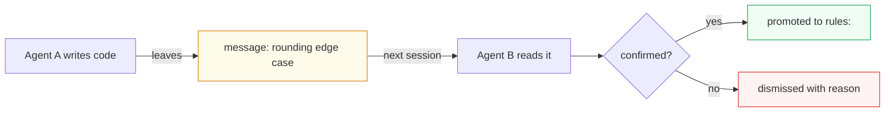
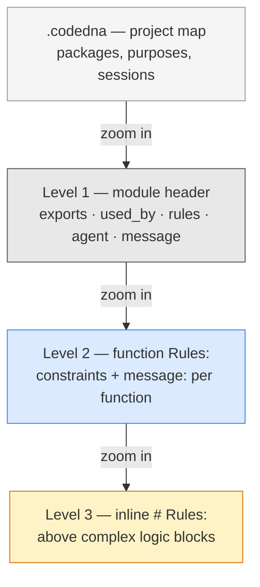

# CodeDNA: An In-Source Communication Protocol for AI Coding Agents

> *The writing agent encodes architectural context. The reading agent decodes it. The file is the channel.*

[](./LICENSE)
[](./SPEC.md)
[](https://doi.org/10.5281/zenodo.19158336)
[](https://codedna.silicoreautomation.space)
[](https://github.com/Larens94/codedna/actions/workflows/ci.yml)
[](https://ko-fi.com/codedna)
[](https://discord.gg/7Fs5J2ua)
[](docs/languages.md)

**Compatible with:**
[](./integrations/CLAUDE.md)
[](./integrations/.cursorrules)
[](./integrations/copilot-instructions.md)
[](./integrations/.windsurfrules)
[](./integrations/AGENTS.md)
[](./QUICKSTART.md)
[](./QUICKSTART.md)

---

**CodeDNA** embeds architectural context directly in source files. AI agents read it, follow it, and leave knowledge for the next agent. No RAG, no vector DB, no external rules files. [11 languages supported](docs/languages.md).


---

## What happens without CodeDNA

Agent opens `utils.py`, fixes a bug. Doesn't know 18 other files import from it. Ships a breaking change.

Next agent opens the same file a week later. Discovers the same constraint the first agent already found. Wastes 20 minutes re-learning what was already known.

Third agent adds a feature. Calls `get_invoices()` without filtering suspended tenants. The filter requirement was in another file — never seen, never followed.

**Every agent starts from scratch. Knowledge is lost between sessions.**

```mermaid
graph TB
    subgraph WITHOUT["Without CodeDNA"]
        W1["Agent opens utils.py"] --> W2["Grep for callers..."]
        W2 --> W3["Open 12 files randomly"]
        W3 --> W4["Miss 6 critical files"]
        W4 --> W5["Ship broken change"]
    end
    
    subgraph WITH["With CodeDNA"]
        C1["Agent opens utils.py"] --> C2["Read used_by: 3 callers"]
        C2 --> C3["Open 3 files directly"]
        C3 --> C4["Read rules: filter required"]
        C4 --> C5["Ship correct fix"]
    end

    style WITHOUT fill:#fef2f2,stroke:#dc2626
    style WITH fill:#f0fdf4,stroke:#16a34a
```



## What happens with CodeDNA

```python
"""billing/revenue.py — Monthly revenue aggregation from paid invoices.

exports: monthly_revenue(year, month) -> dict
used_by: api/reports.py → revenue_route | api/serializers.py → RevenueSchema [cascade]
rules:   get_invoices() returns ALL tenants — caller MUST filter is_suspended() BEFORE aggregating
agent:   claude-sonnet-4-6 | 2026-03-10 | Implemented monthly_revenue.
         message: "rounding edge case in multi-currency — investigate before next release"
agent:   gemini-2.5-pro | 2026-03-18 | Added annual_summary.
         message: "@prev: confirmed, promoted to rules:. New: timezone rollover in January"
"""
```

One read. The agent knows:
- **`used_by:`** — 2 files depend on me, one is `[cascade]` (must update if I change)
- **`rules:`** — there's a suspended-tenant trap in the upstream function
- **`message:`** — the previous agent found a rounding bug and the one after confirmed it

No grep. No reading 18 files. No re-discovering constraints. **The file tells you everything.**

---

## Real results from real experiments

### `used_by:` — Agents find the right files

SWE-bench, 5 Django tasks, 3 models. Same prompt, same tools. Only difference: CodeDNA annotations.

| Model | Without | With CodeDNA | Improvement |
|---|---|---|---|
| Gemini 2.5 Flash | 60% F1 | **72% F1** | **+13pp** (p=0.040) |
| DeepSeek Chat | 50% F1 | **60% F1** | **+9pp** |
| Gemini 2.5 Pro | 60% F1 | **69% F1** | **+9pp** |

### `rules:` — Agents fix the right pattern

Django bug #13495. Same model (Claude Sonnet), same prompt, same bug.

| | Without | With CodeDNA |
|---|---|---|
| Files matching official Django patch | 6/7 | **7/7** |
| `time_trunc_sql` fixed (same pattern, line below the bug) | Missed | **Fixed** |
| Failed edits | 5 | **0** |

**What made the difference:** one `Rules:` annotation that said "timezone conversion must happen BEFORE datetime functions." The control agent saw the same code on the line below the bug — and didn't touch it.

### `message:` — Agents talk to each other

5-agent team builds a SaaS webapp. 83 minutes, DeepSeek R1. **No agent was told to use `message:`.**

Result: **53 notes left across 54 files.** Three patterns emerged:

```python
# Pattern 1: "I built this, here's what's missing next"
agent:   AgentIntegrator | implemented memory with similarity search
         message: "implement memory summarization for long conversations"

# Pattern 2: "I noticed a risk but couldn't verify it"
agent:   Product Architect | created auth service skeleton
         message: "verify that refresh token rotation prevents replay attacks"

# Pattern 3: "Consider this architectural improvement"
agent:   DataEngineer | created billing models
         message: "ensure credit balance calculation uses materialized view for performance"
```

**Without `message:`, none of these notes exist.** The next agent opens `auth_service.py` and has no idea that refresh token rotation needs verification. The agent that opens `memory_manager.py` doesn't know summarization is needed. Every agent starts from scratch.

**With `message:`, the codebase knows what it's missing.** That's the difference between a prototype and a product.



> [Full benchmark](docs/benchmark.md) · [Experiment details](docs/experiments.md) · [Raw data](benchmark_agent/runs/)

---

## How it works




> Without CodeDNA: agent opens random files, misses 8/10 critical files. With CodeDNA: follows `used_by:` chain, finds 6/10. Retry risk -52%.
> [Interactive version](./docs/codedna_viz_3metaphors.html)

---

## Who is CodeDNA for?

| You are... | Without CodeDNA | With CodeDNA |
|---|---|---|
| **Non-technical user** | Must learn prompt engineering to guide the AI | Describe the problem — annotations provide structural context |
| **Junior developer** | AI finds the obvious file, misses the 5 related ones | `used_by:` graph surfaces related files |
| **Senior developer** | Writes detailed prompts every session | Writes annotations once — context persists |
| **Team lead** | Each developer's AI makes different mistakes | Annotations encode team knowledge |

---

## Quick Start

### Option 1 — Claude Code Plugin (recommended)

```bash
claude plugin marketplace add Larens94/codedna
claude plugin install codedna@codedna
```

Includes 4 hooks + 4 skills. On first session, the agent will ask you to choose a mode.

### Option 2 — Other AI Tools

```bash
bash <(curl -fsSL https://raw.githubusercontent.com/Larens94/codedna/main/integrations/install.sh) <tool>
```

| Tool | Command | Enforcement |
|---|---|---|
| **Cursor** | `cursor-hooks` | Active — hook scripts in `.cursor/hooks/` |
| **GitHub Copilot** | `copilot-hooks` | Active — `.github/hooks/hooks.json` |
| **Cline** | `cline-hooks` | Active — `.clinerules/hooks/` |
| **OpenCode** | `opencode` | Active — JS plugin in `.opencode/plugins/` |
| Windsurf | `windsurf` | Instructions only |
| Claude Code (manual) | `claude-hooks` | Active — alternative to Option 1 |

> Full setup guide: [QUICKSTART.md](./QUICKSTART.md) · [integrations/README.md](./integrations/README.md)

### Option 3 — Annotate existing files (CLI)

```bash
pip install git+https://github.com/Larens94/codedna.git

codedna init /path/to/project --no-llm     # Free — structural only (exports + used_by via AST)
codedna init /path/to/project --model ollama/llama3   # Free — local LLM adds rules:
codedna check /path/to/project              # Coverage report
```

---

## Modes

Configure how strict CodeDNA is, based on who writes the code:

| Mode | Who writes code | Semantic naming | L2 Rules: | Inline annotations | Header type |
|---|---|---|---|---|---|
| **human** | Mostly human | Off | Critical functions only | Optional | Reduced for non-Python |
| **semi** | Human + AI together | New code only | All public functions | Recommended | Reduced for non-Python |
| **agent** | Mostly AI agents | Enforced everywhere | All functions + rename vars | Required | Full everywhere |

Set in `.codedna` at project root:

```yaml
project: myapp
mode: semi    # human | semi | agent
```

On first session, the agent will ask which mode to use. Default: `semi`.

**Header types by language:**
- **Python, Ruby**: full header (`exports:`, `used_by:`, `rules:`, `agent:`, `message:`)
- **All other languages**: reduced header (`rules:`, `agent:`, `message:`) — LLMs infer exports and reverse dependencies from the language's native visibility/namespace system

---

## The Four Levels

**Level 0 — Project Manifest (`.codedna`)** — the view from far away. Package structure + session log.

**Level 1 — Module Header** — the view from close up (~50 tokens per file):

```python
"""orders/orders.py — Order lifecycle management.

exports: get_active_orders() -> list[dict] | create_order(user_id, items) -> None
used_by: analytics/revenue.py → get_revenue_rows
rules:   User system uses soft delete — NEVER return orders where users.deleted_at IS NOT NULL.
agent:   claude-sonnet-4-6 | anthropic | 2026-03-10 | s_001 | Implemented order lifecycle.
         message: "bulk delete not tested with >1000 orders — verify before release"
"""
```

**Level 2 — Function-Level Rules** — the view from very close (sliding-window safe):

```python
def get_active_orders() -> list[dict]:
    """Return all non-cancelled orders for active users.

    Rules:   MUST JOIN users and filter deleted_at before returning results.
    message: claude-sonnet-4-6 | 2026-03-10 | pagination not implemented — will OOM on >50k orders
    """
```

**Level 3 — Semantic Naming** — agent-first cognitive compression:

```python
list_dict_users_from_db  = get_users()          # not: data = get_users()
int_cents_price_from_req = request.json["price"] # not: price = request.json["price"]
```

> Full specification: [SPEC.md](./SPEC.md)

---

## Benchmark Results

| Model | Ctrl F1 | DNA F1 | **Δ F1** | p-value |
|---|---|---|---|---|
| **Gemini 2.5 Flash** | 60% | **72%** | **+13pp** | 0.040 |
| **DeepSeek Chat** | 50% | **60%** | **+9pp** | 0.11 |
| **Gemini 2.5 Pro** | 60% | **69%** | **+9pp** | 0.11 |

CodeDNA is most effective on **dependency chain tasks** (up to +22pp). On cross-cutting tasks (same fix in N unrelated files), the benefit is ~0% — a known limitation.

| Experiment | Key result |
|---|---|
| **Multi-agent RPG** (5 agents, DeepSeek Chat) | 1.6x faster, playable game vs static scene |
| **Multi-agent SaaS** (5 agents, DeepSeek R1) | 98.2% annotation adoption, lower complexity |
| **Fix quality** (Claude Sonnet, django-13495) | 7/7 patch files vs 6/7, zero failed edits |

> [Detailed benchmark](docs/benchmark.md) · [Experiment reports](docs/experiments.md) · [Raw data](benchmark_agent/runs/)

---

## Roadmap

| Milestone | Status |
|---|---|
| **M1** — Protocol v0.8, CLI, AST extraction, `message:` | Done |
| **M3** — Enforcement hooks (Claude, Cursor, Copilot, Cline, OpenCode) | Done |
| **M4** — 11 languages + template engines | Done |
| **M2** — SWE-bench Verified (500 tasks, 12 repos) | In progress |
| **M5** — VSCode extension (used_by graph, agent timeline) | Planned |
| **M6** — arXiv preprint, ICSE submission | Planned |

---

## Documentation

| Document | What it covers |
|---|---|
| [SPEC.md](./SPEC.md) | Full technical specification v0.8 |
| [QUICKSTART.md](./QUICKSTART.md) | Setup guide for every AI tool |
| [docs/benchmark.md](docs/benchmark.md) | SWE-bench results, per-task analysis, annotation integrity |
| [docs/experiments.md](docs/experiments.md) | Multi-agent team experiments (RPG, SaaS, fix quality) |
| [docs/languages.md](docs/languages.md) | 11 languages, PHP/Laravel/Phalcon, template engines |
| [integrations/README.md](integrations/README.md) | Tool-specific installation reference |
| [CONTRIBUTING.md](./CONTRIBUTING.md) | Dev setup, contribution guidelines |

---

## A note from the author

I built CodeDNA because AI agents kept making mistakes not because they were wrong, but because they had no context. What if the context was already *in the file*?

The benchmark is real, the data is reproducible, and the spec is open. Try it, break it, improve it — or just tell me what you think.

If CodeDNA saved you some context tokens, a coffee is always welcome: [ko-fi.com/codedna](https://ko-fi.com/codedna)

— Fabrizio

---

## Contributing

See [CONTRIBUTING.md](./CONTRIBUTING.md). Examples in any language are welcome.

## License

[MIT](./LICENSE)
