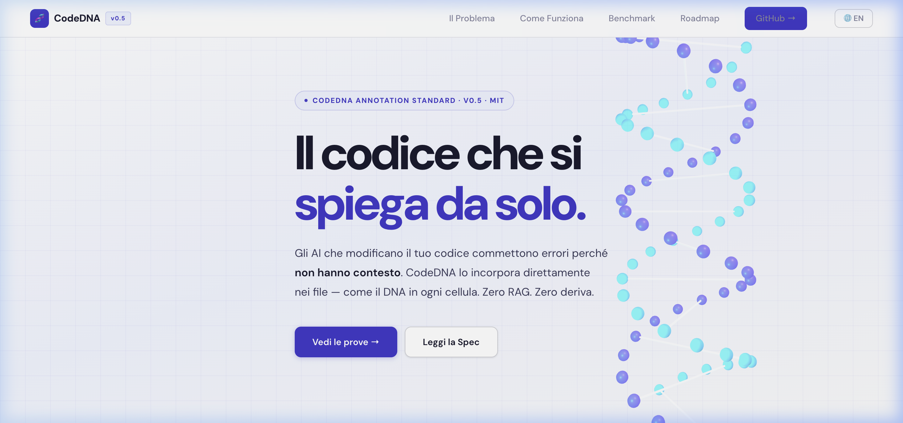

# 🧬 CodeDNA: An In-Source Communication Protocol for AI Coding Agents

> *An in-source communication protocol where the writing agent encodes architectural context and the reading agent decodes it. The file is the channel. Every fragment carries the whole.*

[](./LICENSE)
[](./SPEC.md)
[](https://doi.org/10.5281/zenodo.19110474)
[](https://codedna.silicoreautomation.space)
[](https://github.com/Larens94/codedna/actions/workflows/ci.yml)
[](https://github.com/Larens94/codedna/actions/workflows/codeql.yml)

**Compatible with:**
[](./QUICKSTART.md)
[](./integrations/CLAUDE.md)
[](./integrations/.cursorrules)
[](./integrations/copilot-instructions.md)
[](./integrations/.cursorrules)
[](./QUICKSTART.md)


**CodeDNA** is an **inter-agent communication protocol** implemented as in-source annotations. The writing agent embeds architectural context directly into source files; the reading agent decodes it at any point in the file. Like biological DNA — cut a hologram in half and you get two smaller complete images.

**No RAG. No vector DB. No external rules files. Minimal drift (context co-located with code).**

> **🎯 Less Prompt Engineering Needed:** CodeDNA annotations help AI agents navigate the codebase with less manual guidance. Even less-technical users can get better multi-file fixes by describing the problem — the architectural context is already in the code.



## How it works — live benchmark data


> Three visual metaphors, same real data (django__django-11808 · DeepSeek-Chat · 5 runs).
> **Without CodeDNA**: agent opens 2 random files and stops — 8/10 critical files missed.
> **With CodeDNA**: follows the `used_by:` chain — finds 6/10 critical files. Retry risk −52%.
> [▶ Interactive version](./paper/codedna_viz.html)

> **🔄 The Network Effect:** When an AI agent writes CodeDNA annotations, it leaves a navigable trail for every other agent that reads the code after it — regardless of vendor or model. The more agents that participate, the more useful the protocol becomes.

---

## 🤔 Who is CodeDNA for?

| You are… | Without CodeDNA | With CodeDNA |
|---|---|---|
| **Non-technical user** | Must learn prompt engineering to guide the AI agent through the codebase | Just describe the problem — annotations guide the agent automatically |
| **Junior developer** | AI finds the obvious file, misses the 5 related ones | `used_by:` graph helps find related files that may need changes |
| **Senior developer** | Spends time writing detailed prompts every session | Writes annotations once, benefits persist across sessions |
| **Team lead** | Each developer's AI makes different mistakes | Annotations encode team knowledge — more consistent results |

**The core idea:** today, the quality of AI-assisted coding often depends on the *user's* ability to prompt. CodeDNA moves some of that knowledge from ephemeral prompts into persistent, version-controlled source code.

---

## ⚡ 2-Minute Setup

### One-Line Install (CLI)

```bash
bash <(curl -fsSL https://raw.githubusercontent.com/Larens94/codedna/main/integrations/install.sh)
```

Install for a **single tool** only:

```bash
bash <(curl -fsSL https://raw.githubusercontent.com/Larens94/codedna/main/integrations/install.sh) cursor
# Options: claude | cursor | copilot | cline | windsurf | agents | all
```

### Manual Setup

**Pick your AI tool and paste:**

| Tool | File to create | Source |
|---|---|---|
| Cursor | `.cursorrules` | [`integrations/.cursorrules`](./integrations/.cursorrules) |
| Claude Code | `CLAUDE.md` | [`integrations/CLAUDE.md`](./integrations/CLAUDE.md) |
| GitHub Copilot | `.github/copilot-instructions.md` | [`integrations/copilot-instructions.md`](./integrations/copilot-instructions.md) |
| Antigravity / Custom | System prompt | See [QUICKSTART.md](./QUICKSTART.md) |
| Any other LLM | Any of the above | See [QUICKSTART.md](./QUICKSTART.md) |

Then annotate your first file → see [QUICKSTART.md](./QUICKSTART.md)

---

## 📊 Benchmark — SWE-bench Multi-Model Results

5 real Django issues from [SWE-bench](https://github.com/princeton-nlp/SWE-bench), tested across multiple LLMs. Same prompt, same tools, same tasks. **Only difference: CodeDNA annotations.**

> **Metric: File Localization F1** — harmonic mean of recall and precision on files read vs ground truth. Isolates the navigation bottleneck that precedes code generation.

> **Statistical test:** Wilcoxon signed-rank test (one-tailed, H1: CodeDNA > Control) over F1 pairs across 5 tasks. N=5 with ≥5 runs per task at T=0.1.

| Model | Ctrl F1 | DNA F1 | **Δ F1** | p-value | Tasks Won |
|---|---|---|---|---|---|
| **Gemini 2.5 Flash** | 60% | **72%** | **+13%** | 0.040* | 4/5 |
| **DeepSeek Chat** | 50% | **60%** | **+9%** | 0.11 | 4/5 |
| **Gemini 2.5 Pro** | 60% | **69%** | **+9%** | 0.11 | 3/5 |

> 3 of 3 models complete. Full data: [`benchmark_agent/runs/`](./benchmark_agent/runs/)
>
> Gemini 2.5 Flash: W+=14, N=5, p=0.040 ✅ significant. DeepSeek Chat: W+=12, N=5, p=0.11. Gemini 2.5 Pro: W+=12, N=5, p=0.11. All runs: 5 tasks × 3–5 runs at T=0.1.

### When CodeDNA Helps Most

Empirical analysis across 5 tasks (Gemini 2.5 Flash, ≥5 runs each) reveals a clear pattern:

| Task type | Example | Δ F1 |
|---|---|---|
| **Clear dependency chain** — A calls B which delegates to C | `dbshell → client → subprocess` (12508) | **+9%** |
| **Delegation with backend fan-out** — one interface, N backends | `Trunc → ops.date_trunc_sql` (13495) | **+21%** |
| **Feature addition with flag gating** — new capability across feature/schema layers | `INCLUDE clause in Index` (11991) | **+17%** |
| **XOR feature with multi-layer propagation** | `Q() XOR support` (14480) | **+18%** |
| **Cross-cutting fix** — same pattern in N unrelated files, no shared ancestor | `__eq__ NotImplemented` (11808) | **~0%** |

> **Transparency note on 11808:** the cross-cutting task was included deliberately to test the limits of the protocol. The benchmark annotations do **not** pre-populate a list of affected files — the agent must discover them independently. CodeDNA v0.7 shows Δ ≈ 0% on this task type. This is reported as a known limitation, not hidden. See [SPEC.md §2.4](./SPEC.md) for the proposed v0.8 extension (`cross_cutting_patterns:`) and why it would not constitute cheating.

**CodeDNA is most effective when there is a navigable call chain.** The `used_by:` graph guides the agent from entry point to all affected files. For cross-cutting concerns (same fix in many independent files with no shared ancestor), the benefit is smaller because there is no natural navigation path to follow.

### Annotation Integrity Audit

A full audit of the benchmark annotations was performed to verify that no task-specific hints were embedded in the `codedna/` files. The question: do the annotations guide the agent to the right files by describing the architecture, or by encoding the solution?

**Methodology:** for each task, every ground-truth file (from `files_in_patch`) was inspected. The `used_by:` targets were classified as GT (ground-truth) or non-GT. The `rules:` field was checked for task-specific prescriptions vs architectural descriptions.

**Findings per task:**

| Task | `used_by:` verdict | `rules:` verdict |
|------|---|---|
| **11808** (`__eq__`) | Files are independent — no `used_by:` chain exists by design | Describes Python data model convention, not a file list. Δ≈0% confirms annotations gave no navigation advantage |
| **14480** (XOR) | 16 targets in `query_utils.py`; only 2 are GT, both genuine callers | Describes connector system mechanics; agent still needs to reason which files to open |
| **13495** (Trunc tzinfo) | `base/operations.py` lists all 4 backends — they are literally all the backends that exist | `_convert_field_to_tz()` mentioned per-backend: accurate architecture, not a fix prescription |
| **11991** (INCLUDE) | `base/schema.py` initially listed only `postgresql/schema.py`; **corrected during audit to include all 4 backend schema editors** | Architectural delegation pattern; no file list for the fix |
| **12508** (dbshell -c) | `base/client.py` lists all 4 backend clients — complete by definition | `dbshell.py` rules describe existing architecture accurately; no other rules were possible given the file's 6-line body |

**Annotation correction made during audit:** `django/db/backends/base/schema.py` in `django__django-11991/codedna/` had an incomplete `used_by:` listing only `postgresql/schema.py`. All four backend schema editors (`mysql`, `oracle`, `postgresql`, `sqlite3`) genuinely inherit from `BaseDatabaseSchemaEditor`. The annotation was updated to reflect the complete inheritance graph.

**Verdict: the benchmark annotations are architecturally accurate and do not encode task-specific solutions.** Where GT files appear in `used_by:` targets, it is because those files are genuine callers or subclasses — not because the annotator cherry-picked them. The empirical results support this: tasks with navigable chains show Δ>0%, the cross-cutting task (11808) shows Δ≈0% regardless of the `rules:` text.

**The contrast with a generic LLM response** illustrates the difference. When shown the `dbshell.py` file with its CodeDNA annotation, a generic assistant (tested with Gemini) explained what the code does but did not navigate to `base.py → add_arguments()` or `BaseDatabaseClient → runshell()` as the next files to modify. A CodeDNA-aware agent reads the `rules:` field and immediately knows which files to open — not because the annotation names the fix, but because it accurately describes the delegation chain that must be modified.

### The Cheaper-Model Hypothesis

The working hypothesis — now supported by two data points:

> **Less capable, cheaper models benefit more from CodeDNA.** A frontier model navigates large codebases well by general reasoning. A cheaper model without structural guidance gets lost, loops, or stops early. CodeDNA provides the scaffolding that lets a cheap model approach the navigation quality of a more expensive one.

**Evidence from all 3 models:** Gemini 2.5 Flash (Δ=+13pp, p=0.040), DeepSeek Chat (Δ=+9pp), Gemini 2.5 Pro (Δ=+9pp). Flash shows the strongest benefit. Interestingly, Pro ctrl=60% matches Flash — Pro is not stronger on these navigation tasks. Task 13495 is consistently negative for both DeepSeek (−9pp) and Pro (−8pp) but positive for Flash (+22pp) — a structural anomaly under investigation.

This makes CodeDNA economically attractive: annotate once, run cheaper models with comparable accuracy.

Full data: [`benchmark_agent/runs/`](./benchmark_agent/runs/) · Script: [`benchmark_agent/swebench/run_agent_multi.py`](./benchmark_agent/swebench/run_agent_multi.py)

---

## 🗺️ Roadmap

CodeDNA v0.7 is the research prototype. The planned development path:

| Milestone | Goal | Status |
|---|---|---|
| **M1 — Protocol & CLI** | v1.0 spec · `codedna verify` · `codedna update` · AST-based auto-extraction · PyPI | 🔜 |
| **M2 — Benchmark Expansion** | 20+ SWE-bench tasks · 5+ LLMs · Zenodo dataset · public dashboard | 🔜 |
| **M3 — Editor & Workflow** | VS Code extension (used_by graph · agent timeline · model heatmap) · pre-commit hook · GitHub Action CI | 🔜 |
| **M4 — Language Extension** | JavaScript/TypeScript · Go · Rust · full docs rewrite | 🔜 |
| **M5 — Research & Dissemination** | arXiv preprint · ICSE NIER/workshop submission · annotate Flask, FastAPI | 🔜 |

> This roadmap is part of a funding application to [NLnet NGI0 Commons Fund](https://nlnet.nl/commonsfund/) (deadline April 1st 2026). If you find CodeDNA useful and want to support its development, ⭐ the repo and share it.

---

## 🔬 In Development — v0.8 Features *(not yet tested)*

The following features are being designed for v0.8. They are **not part of the current spec**, have not been validated in benchmark conditions, and the format may change before release.

### `message:` — Persistent Agent Chat in Code

The `agent:` field records what an agent did. The proposed `message:` sub-field adds a **conversational layer** — soft observations, open questions, and forward-looking notes left directly for the next agent.

```python
"""analytics/revenue.py — Monthly/annual revenue aggregation.

...
agent:   claude-sonnet-4-6 | anthropic | 2026-03-10 | Implemented monthly_revenue.
         message: "rounding edge case in multi-currency — investigate before next release"
agent:   gemini-2.5-pro    | google    | 2026-03-18 | Added annual_summary.
         message: "@prev: confirmed, promoted to rules:. New: timezone rollover in January"
"""
```

`message:` works at **both levels**:
- **Level 1 (module docstring)** — for agents that read the full file
- **Level 2 (function docstring)** — for agents using a sliding window that never sees the top of the file

The lifecycle: an observation left in `message:` either gets promoted to `rules:` (architectural truth confirmed) or dismissed with a reply. Append-only, never deleted.

### Agent Telemetry via Git Trailers

Git is already immutable, append-only, and diff-complete. The proposed approach uses **git trailers** — the same standard as `Co-Authored-By:`, natively recognised by GitHub — to embed AI session metadata directly in commit messages:

```
implement monthly revenue aggregation

AI-Agent:    claude-sonnet-4-6
AI-Provider: anthropic
AI-Session:  s_a1b2c3
AI-Visited:  analytics/revenue.py, payments/models.py, api/reports.py
AI-Message:  found rounding edge case in multi-currency — investigate before next release
```

Git already records the diff, date, and changed files. `AI-Visited:` is the only addition — files **read** during the session, which git does not track natively.

This gives you audit queries immediately:

```bash
git log --grep="AI-Agent:"                          # all AI commits
git log --grep="AI-Agent: claude" -p -- revenue.py  # claude's changes to a file
git log --format="%b" | grep "AI-Agent:" | sort | uniq -c  # model distribution
```

Three-tier architecture: **git** (authoritative audit, full diff) ↔ **`.codedna`** (lean session summary for agent navigation) ↔ **file `agent:` field** (one-liner, sliding-window safe). A `session_id` links all three.

### VSCode Extension (planned, M3)

Built on top of `git log` with AI trailers:
- **CodeLens** — last AI agent + commit count inline on every file and function
- **File heatmap** — how many AI sessions touched each file, by provider
- **Agent Timeline** — chronological session log with git diff per session
- **Stats panel** — model distribution chart, navigation efficiency per model

> Full spec: [SPEC.md §4.7–4.8](./SPEC.md)

---

## 🧬 The Four Levels

### Level 0 — Project Manifest `.codedna` *(The view from far away)*

A single YAML file at the repo root. The agent reads this first — before opening any source file — to understand packages, their purposes, and inter-package dependencies.

```yaml
# .codedna — auto-generated by codedna init
project: myapp
packages:
  payments/:
    purpose: "Invoice generation, payment processing"
  analytics/:
    purpose: "Revenue reports, KPI dashboards"
    depends_on: [payments/, tenants/]
  tenants/:
    purpose: "Multi-tenant management, suspension"
```

### Level 1 — Module Header *(The view from close up: ~50 tokens)*

A docstring at the top of every file. Only includes information that **cannot be inferred from the code**: the public API (`exports:`), who depends on this file (`used_by:`), and domain constraints (`rules:`). Import statements already declare dependencies — no need to duplicate them.

```python
"""orders/orders.py — Order lifecycle management.

exports: get_active_orders() -> list[dict] | create_order(user_id, items) -> None
used_by: analytics/revenue.py → get_revenue_rows
rules:   User system uses soft delete — NEVER return orders for users
         where users.deleted_at IS NOT NULL. Always JOIN on users.
"""
```

### Level 2 — Function-Level Rules *(The view from very close)*

`Rules:` docstrings on critical functions, written **organically** by agents as they discover constraints. Each agent that fixes a bug or learns something important leaves a `Rules:` for the next agent — knowledge accumulates over time.

```python
def get_active_orders() -> list[dict]:
    """Return all non-cancelled orders for active (non-deleted) users.

    Rules:   MUST JOIN users and filter deleted_at before returning results.
             Failure to filter inflates revenue reports with deleted-user orders.
    """
```

### Level 3 — Semantic Naming *(Cognitive compression)*

Variable names encode type, shape, domain, and origin. Any 10-line extract is self-documenting.

```python
# ❌ Standard — agent must trace the entire call chain
data  = get_users()
price = request.json["price"]

# ✅ CodeDNA — readable in any context window
list_dict_users_from_db  = get_users()
int_cents_price_from_req = request.json["price"]
```

### Planner Read Protocol

To plan edits across 10+ files: read `.codedna` first, then read only the module docstring of each file (first 8–12 lines), build an `exports:` → `used_by:` graph, then open only the relevant files in full.

---

## 🎯 Annotation Design Principle — Architecture, Not Answers

The most important rule for writing `rules:` annotations: **describe the architectural mechanism, not the solution**.

**Wrong** — gives away the answer:
```python
rules:   Fix mysql/operations.py, oracle/operations.py, postgresql/operations.py,
         and sqlite3/operations.py to handle tzname in date_trunc_sql().
```
An agent reading this copies the list without opening the files. It scores zero on any file-localization metric.

**Correct** — describes the mechanism:
```python
rules:   Trunc.as_sql() delegates to connection.ops.date_trunc_sql() and
         time_trunc_sql(), passing tzname. Each backend implements these
         methods independently with its own timezone strategy.
```
The agent reads this, understands the delegation chain, uses `.codedna` to find the backends, then **reasons** which ones to open based on the problem context.

### `used_by:` is a navigation map, not an open list

An agent that opens every `used_by:` target would be slower and less precise. The correct behavior is:

1. Read the `used_by:` field to know **who depends on this file**
2. Read the problem description and `.codedna` manifest
3. **Reason** about which consumers are relevant to the current task
4. Open only those — ignore the rest

This is why CodeDNA improves both F1 **and** efficiency: the agent reads fewer files but finds more of the right ones. Our benchmark shows CodeDNA runs achieving P=100% (zero wasted reads) while Control runs scatter across irrelevant files.

### The `.codedna` manifest as a reasoning enabler

The project manifest is injected into the agent's first message so it has the full structural map before making any tool call. Combined with module-level `rules:`, this lets the agent answer: *"given this problem, which of these packages and modules are relevant?"* — without reading every file first.

---

## 🚀 Fine-Tuning Potential

Current benchmark results are **zero-shot** — models reading CodeDNA annotations with no prior training on the protocol. They follow `used_by:` links and `rules:` hints by general language understanding alone.

If a foundation model were fine-tuned specifically on the CodeDNA protocol:

- `exports:` / `used_by:` / `rules:` would be recognized as native structured signals, not free text to interpret
- Navigation via `used_by:` would become automatic rather than reasoned — reducing variance dramatically
- The agent would know precisely when to stop exploring (precision) and when to follow another link (recall)
- Token cost would drop further: the agent reads only headers until context demands a full file

This is fundamentally different from RAG or GitHub Copilot. It is not retrieval — it is **semantically guided navigation embedded in the source**. A fine-tuned model would treat CodeDNA the way a human senior engineer treats a well-documented codebase: instant orientation, minimal reading, maximum coverage.

### Inter-Agent Communication at Scale

CodeDNA's `rules:` field is an **asynchronous message channel between agents**. Agent A writes architectural context into a file; Agent B reads it weeks later in a different session with a different model. No shared memory, no coordination protocol — the file is the channel.

This scales naturally to multi-agent pipelines: a planning agent annotates while exploring, an implementation agent reads and acts, a review agent checks and updates `rules:` with discovered constraints. Each agent leaves the codebase more navigable for the next.

### CodeDNA as a Self-Generating Training Corpus

A CodeDNA-annotated codebase with active agent usage is simultaneously a **protocol**, an **environment**, and a **training dataset** — at three levels of supervision signal:

**SFT (Supervised Fine-Tuning)**
The append-only `agent:` field accumulates an ordered, file-scoped log of correct navigational decisions. Each line encodes what an agent did, what constraint it discovered, and what it left for the next session. Across thousands of files and sessions, this is a dense demonstration dataset of expert codebase navigation grounded in real task outcomes — zero labelling cost.

**DPO / Preference Alignment**
The git history with [AI trailers](#agent-telemetry-via-git-trailers) produces naturally occurring `(rejected, chosen)` pairs:

```
commit a3f2b1 — Agent A: "added invoice logic — skipped suspension check"
commit b7c903 — Agent B: "FIXED: suspension check was missing"
                         rules: updated → "Suspension check REQUIRED before billing"
```

Agent A's commit is `rejected`. Agent B's corrective commit is `chosen`. The pair is already labelled, complete with visited-file lists (`AI-Visited:`), session IDs, and agent-written rationale (`AI-Message:`) — produced at zero marginal cost during normal development.

**PRM (Process Reward Model)**
The session trace infrastructure (`traces_to_training.py`) records the full ordered sequence of tool calls per session. Combined with the binary task outcome, each trace becomes a labelled reasoning trajectory. Steps on a successful session receive positive reward; steps on a failed session can be assigned negative signal — enabling a process-level reward model trained on real agent behaviour.

**The Data Flywheel**

```
Better models → more accurate annotations
                        ↓
           More informative preference pairs
                        ↓
             Better process reward models
                        ↓
              Sharper navigational policy
                        ↓
             Better models  ←─────────────┘
```

Each agent session that writes or corrects a CodeDNA annotation improves the training signal available to all future model generations — without additional human labelling or dedicated data collection infrastructure.

---

## 🔄 Inter-Agent Knowledge Accumulation

CodeDNA is built for environments where **multiple AI agents work on the same codebase over time** — different models, different tools, different sessions. Each agent leaves knowledge for the next:

```
Agent A fixes a bug → adds Rules: "MUST filter soft-deleted users"
         ↓
Agent B reads Rules: → avoids the same bug without re-discovering it
         ↓
Agent C discovers a related edge case → extends the Rules:
         ↓
Knowledge accumulates organically in the codebase
```

Unlike documentation (which goes stale), `Rules:` annotations are **co-located with the code** — they are read every time the function is edited.

### Verification Agents

Because agents can hallucinate, `Rules:` annotations may contain incorrect information. A wrong annotation — e.g., "MUST filter by tenant_id" when no such filter exists — could propagate into every future agent's output.

**Solution: verification agents** that periodically cross-check annotations against the actual code. This is the cost of the savings — annotation maintenance. But because annotations are structured and machine-readable, this maintenance is also automatable.

| Without CodeDNA | With CodeDNA |
|---|---|
| N agents rediscover the same constraint | One writes `Rules:`, N benefit |
| Bugs re-introduced across sessions | Constraints preserved across sessions |
| Human writes prompts every session | Knowledge accumulates automatically |

> **See [SPEC.md §8.5–8.7](./SPEC.md) for the full inter-agent model, verification protocol, and cost analysis.**

---

## 🌐 Language Support

CodeDNA v0.7 is validated on **Python** using the native module docstring format. Support for other languages is planned for future versions.

---

## 📁 Repository Structure

```
codedna/
├── README.md               ← you are here
├── QUICKSTART.md           ← 2-minute setup for every AI tool
├── SPEC.md                 ← full technical specification v0.7
├── integrations/
│   ├── CLAUDE.md               ← Claude Code system prompt
│   ├── .cursorrules             ← Cursor rules file
│   ├── copilot-instructions.md ← GitHub Copilot instructions
│   └── install.sh              ← one-line installer for all tools
├── benchmark_agent/
│   ├── swebench/
│   │   ├── run_agent_multi.py      ← multi-model benchmark (5 providers)
│   │   └── analyze_multi.py        ← multi-model comparison
│   └── runs/                       ← results by model
├── examples/
│   └── python/
├── paper/                  ← scientific paper (arXiv preprint)
│   └── codedna_paper.pdf
└── tools/
    └── auto_annotate.py    ← auto-generate exports/used_by for existing codebases
```

---

## 💬 A note from the author

This is my first paper. I'm not a researcher — I'm a developer who is genuinely passionate about AI and how it interacts with code.

I built CodeDNA because I kept running into the same problem: AI agents making mistakes not because they were wrong, but because they had no context. I wondered: what if the context was already *in the file*? What if every snippet the agent read was self-sufficient?

I'm sharing this with complete humility. The benchmark is real, the data is reproducible, and the spec is open. Maybe it's useful to you. Maybe it sparks a better idea. Either way, I hope it contributes something.

If you find it helpful, try it, break it, improve it — or just tell me what you think. Feedback from people who actually use it is the only way this gets better.

— Fabrizio

---

## Contributing

See [`CONTRIBUTING.md`](./CONTRIBUTING.md). Examples in any language are welcome.

## License

[MIT](./LICENSE)
